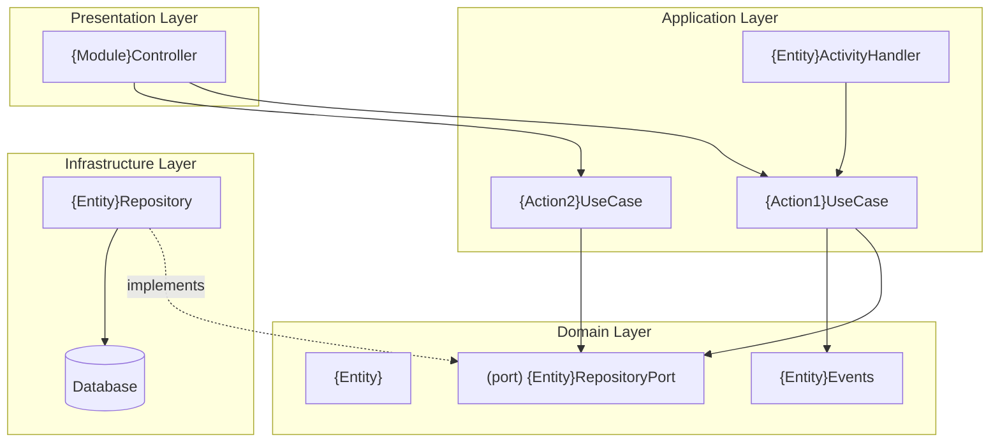
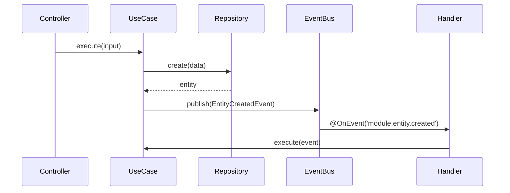

# DESIGN-{feat-id}: {Feature Name} Architecture

## Overview

{Brief description of the architectural approach for this feature.}

## Architecture Diagram



## Module Structure

```
src/{module-name}/
├── {module-name}.module.ts
├── domain/
│   ├── entities/
│   │   └── {entity}.entity.ts
│   ├── events/
│   │   ├── index.ts
│   │   └── {entity}.events.ts
│   ├── errors/
│   │   ├── index.ts
│   │   ├── {module}.error-codes.ts
│   │   ├── {module}.errors.ts
│   │   └── {module}.error-factory.ts
│   └── ports/
│       └── {entity}.repository.port.ts
├── application/
│   ├── use-cases/
│   │   └── {action}.use-case.ts
│   ├── handlers/
│   │   └── {entity}-activity.handler.ts
│   └── dto/
│       ├── {action}.input.ts
│       └── {entity}.output.ts
├── infrastructure/
│   └── repositories/
│       └── {entity}.repository.ts
└── presentation/
    ├── {module-name}.controller.ts
    └── dto/
        ├── {action}.input.dto.ts
        └── {entity}.output.dto.ts
```

## Interface Contracts

### Domain Entities

```typescript
export interface {Entity} {
  readonly id: string;
  // ... properties
  readonly createdAt: Date;
  readonly updatedAt: Date;
}
```

### Port Interfaces

```typescript
export const {ENTITY}_REPOSITORY = Symbol('{ENTITY}_REPOSITORY');

export interface {Entity}RepositoryPort {
  create(input: Create{Entity}Input): Promise<{Entity}>;
  findById(id: string): Promise<{Entity} | null>;
  // ... other methods
}
```

## Event Schemas

### Events Produced

```typescript
export const {Module}EventSchemas = {
  {ENTITY}_{ACTION}: {
    eventName: '{module}.{entity}.{action}',
    schema: new {Entity}{Action}Payload(),
    version: '1.0.0',
    module: '{module}',
    description: '{Description}',
  } as EventSchema<{Entity}{Action}Payload>,
} as const;
```

### Events Consumed

| Event | Source | Handler | Use Case |
|-------|--------|---------|----------|
| `{event.name}` | {module} | `{Entity}ActivityHandler` | `{Action}UseCase` |

## Event Flow



## Database Schema

```prisma
model {Entity} {
  id        String   @id @default(uuid())
  // ... fields
  createdAt DateTime @default(now())
  updatedAt DateTime @updatedAt

  @@map("{entity_table}")
}
```

## Security Considerations

- {Authentication requirements}
- {Authorization rules (roles)}
- {Input validation}
- {Data exposure prevention}

## Task Breakdown

| Task ID | Name | Layer | Dependencies | Complexity |
|---------|------|-------|--------------|------------|
| TASK-{n}-01 | {Task name} | Domain | None | Low |
| TASK-{n}-02 | {Task name} | Application | TASK-{n}-01 | Medium |
| TASK-{n}-03 | {Task name} | Infrastructure | TASK-{n}-01 | Low |
| TASK-{n}-04 | {Task name} | Presentation | TASK-{n}-02 | Medium |
| TASK-{n}-05 | {Task name} | Testing | TASK-{n}-04 | Medium |
