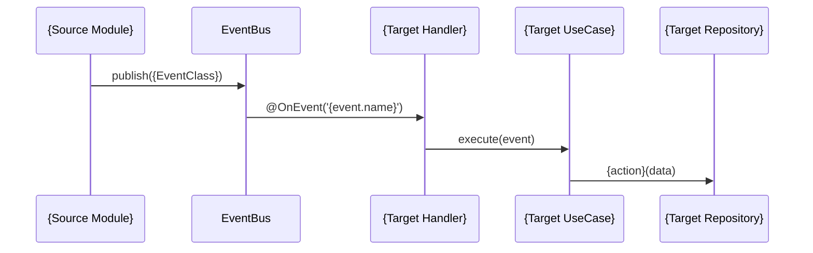

# Event Flow: {Feature Name}

## Event Catalog

### New Events

| Event Name | Module | Payload Class | Trigger | Version |
|------------|--------|---------------|---------|---------|
| `{module}.{entity}.{action}` | {module} | `{Entity}{Action}Payload` | {When emitted} | 1.0.0 |

### Consumed Events

| Event Name | Source Module | Handler Class | Reaction |
|------------|-------------|---------------|----------|
| `{source}.{entity}.{action}` | {source-module} | `{Entity}ActivityHandler` | {What happens} |

## Flow Diagrams

### {Flow Name}

## Idempotency Strategy

| Event | Idempotency Key | Strategy |
|-------|----------------|----------|
| `{event.name}` | `eventId` | {Upsert / Check-before-write / Dedup table} |

## Error Handling

| Event | Failure Scenario | Recovery |
|-------|-----------------|----------|
| `{event.name}` | {What can go wrong} | {Log + retry / Dead letter / Compensating event} |
